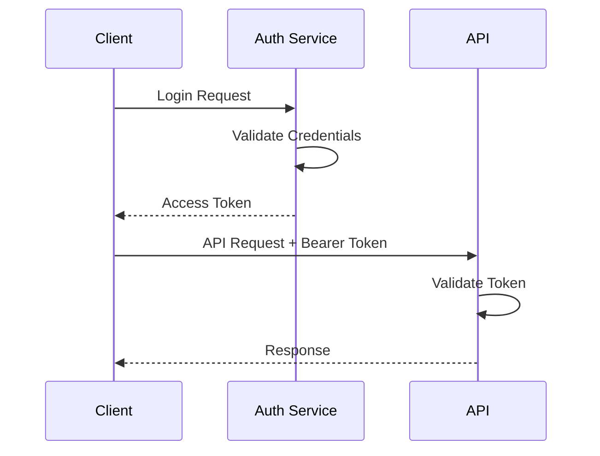
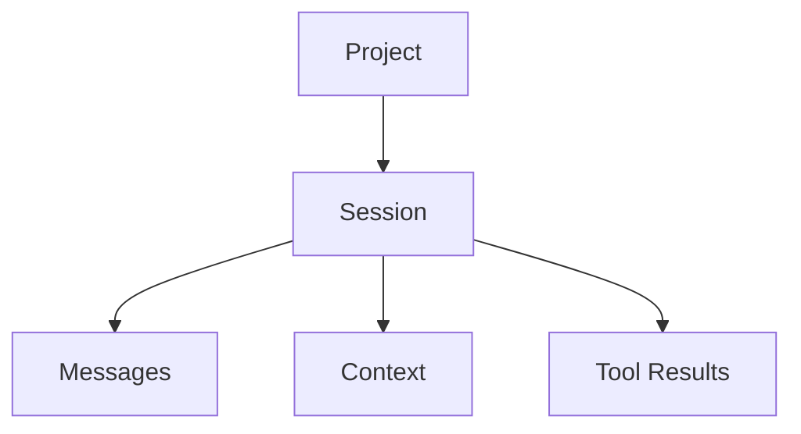
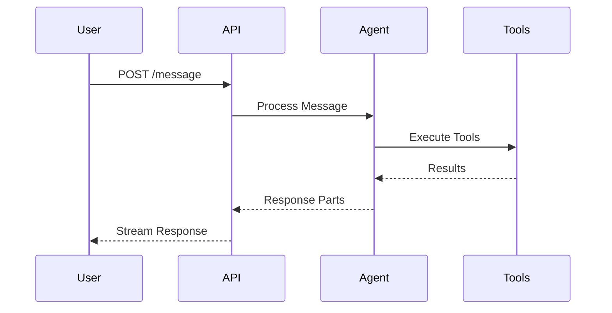
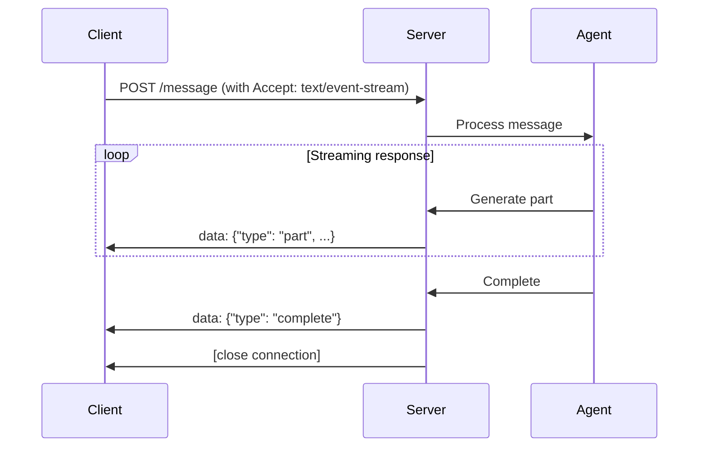

# OpenCode API Documentation

This document provides comprehensive documentation for the OpenCode REST API and WebSocket endpoints.

## Table of Contents

- [Authentication](#authentication)
- [Base URL](#base-url)
- [Response Format](#response-format)
- [Project Management](#project-management)
- [Session Management](#session-management)
- [Message Handling](#message-handling)
- [File Operations](#file-operations)
- [Configuration](#configuration)
- [Real-time Communication](#real-time-communication)
- [Error Handling](#error-handling)

## Authentication

OpenCode uses token-based authentication with OpenAuth integration.



### Headers

All authenticated requests must include:

```
Authorization: Bearer <access_token>
Content-Type: application/json
```

## Base URL

- **Development**: `http://localhost:3000`
- **Production**: `https://api.opencode.ai`

## Response Format

All API responses follow a consistent format:

### Success Response
```json
{
  "success": true,
  "data": { ... },
  "timestamp": "2024-01-15T10:30:00Z"
}
```

### Error Response
```json
{
  "success": false,
  "error": {
    "message": "Error description",
    "code": "ERROR_CODE",
    "details": { ... }
  },
  "timestamp": "2024-01-15T10:30:00Z"
}
```

## Project Management

### List Projects

Get all projects for the authenticated user.

**Endpoint**: `GET /project`

**Response**:
```json
{
  "success": true,
  "data": [
    {
      "id": "proj_123",
      "name": "my-project",
      "path": "/path/to/project",
      "created": "2024-01-15T10:30:00Z",
      "updated": "2024-01-15T10:30:00Z"
    }
  ]
}
```

### Initialize Project

Create a new project in the specified directory.

**Endpoint**: `POST /project/init`

**Request Body**:
```json
{
  "path": "/path/to/project",
  "name": "project-name"
}
```

**Response**:
```json
{
  "success": true,
  "data": {
    "id": "proj_123",
    "name": "project-name",
    "path": "/path/to/project",
    "created": "2024-01-15T10:30:00Z"
  }
}
```

## Session Management

Sessions encapsulate conversation context and project state.



### List Sessions

Get all sessions for a project.

**Endpoint**: `GET /project/:projectID/session`

**Response**:
```json
{
  "success": true,
  "data": [
    {
      "id": "sess_456",
      "projectID": "proj_123",
      "name": "Main Session",
      "directory": "/path/to/project",
      "created": "2024-01-15T10:30:00Z",
      "updated": "2024-01-15T11:00:00Z",
      "status": "active"
    }
  ]
}
```

### Create Session

Create a new session within a project.

**Endpoint**: `POST /project/:projectID/session`

**Request Body**:
```json
{
  "id": "sess_456",  // optional
  "parentID": "sess_123",  // optional
  "directory": "/path/to/project",
  "name": "Session Name"  // optional
}
```

**Response**:
```json
{
  "success": true,
  "data": {
    "id": "sess_456",
    "projectID": "proj_123",
    "parentID": "sess_123",
    "name": "Session Name",
    "directory": "/path/to/project",
    "created": "2024-01-15T10:30:00Z",
    "status": "active"
  }
}
```

### Get Session

Get details of a specific session.

**Endpoint**: `GET /project/:projectID/session/:sessionID`

### Delete Session

Delete a session and all its data.

**Endpoint**: `DELETE /project/:projectID/session/:sessionID`

### Session Actions

#### Initialize Session
**Endpoint**: `POST /project/:projectID/session/:sessionID/init`

#### Abort Session
**Endpoint**: `POST /project/:projectID/session/:sessionID/abort`

#### Share Session
**Endpoint**: `POST /project/:projectID/session/:sessionID/share`

#### Unshare Session
**Endpoint**: `DELETE /project/:projectID/session/:sessionID/share`

#### Compact Session
**Endpoint**: `POST /project/:projectID/session/:sessionID/compact`

#### Revert Session
**Endpoint**: `POST /project/:projectID/session/:sessionID/revert`

#### Unrevert Session
**Endpoint**: `POST /project/:projectID/session/:sessionID/unrevert`

## Message Handling

Messages represent the conversation between the user and AI agent.



### List Messages

Get all messages in a session.

**Endpoint**: `GET /project/:projectID/session/:sessionID/message`

**Response**:
```json
{
  "success": true,
  "data": [
    {
      "info": {
        "id": "msg_789",
        "sessionID": "sess_456",
        "role": "user",
        "content": "Help me fix this bug",
        "created": "2024-01-15T10:30:00Z"
      },
      "parts": [
        {
          "type": "text",
          "content": "Help me fix this bug"
        }
      ]
    }
  ]
}
```

### Create Message

Send a new message to the AI agent.

**Endpoint**: `POST /project/:projectID/session/:sessionID/message`

**Request Body**:
```json
{
  "content": "Help me implement a new feature",
  "context": {
    "files": ["/path/to/file.ts"],
    "selection": {
      "start": { "line": 10, "column": 0 },
      "end": { "line": 15, "column": 20 }
    }
  }
}
```

**Response**: Stream of message parts (see Real-time Communication)

### Get Message

Get a specific message with all its parts.

**Endpoint**: `GET /project/:projectID/session/:sessionID/message/:messageID`

## File Operations

File operations allow interaction with the project's file system.

### Find Files

Search for files in the project directory.

**Endpoint**: `GET /project/:projectID/session/:sessionID/find/file`

**Query Parameters**:
- `query`: Search query (filename pattern)
- `type`: File type filter
- `limit`: Maximum results (default: 100)

**Response**:
```json
{
  "success": true,
  "data": [
    "/path/to/file1.ts",
    "/path/to/file2.js",
    "/path/to/file3.md"
  ]
}
```

### Get File

Get file contents or diff.

**Endpoint**: `GET /project/:projectID/session/:sessionID/file`

**Query Parameters**:
- `path`: File path (required)
- `type`: Response type (`raw` or `patch`)

**Response**:
```json
{
  "success": true,
  "data": {
    "type": "raw",
    "content": "file contents...",
    "encoding": "utf-8"
  }
}
```

### File Status

Get git status for project files.

**Endpoint**: `GET /project/:projectID/session/:sessionID/file/status`

**Response**:
```json
{
  "success": true,
  "data": [
    {
      "path": "/path/to/file.ts",
      "status": "modified",
      "staged": false
    }
  ]
}
```

## Configuration

### Get Provider

Get AI provider configuration for a directory.

**Endpoint**: `GET /provider`

**Query Parameters**:
- `directory`: Project directory path

**Response**:
```json
{
  "success": true,
  "data": {
    "name": "anthropic",
    "model": "claude-3-5-sonnet-20241022",
    "apiKey": "sk-...",
    "baseURL": "https://api.anthropic.com"
  }
}
```

### Get Config

Get OpenCode configuration for a directory.

**Endpoint**: `GET /config`

**Query Parameters**:
- `directory`: Project directory path

**Response**:
```json
{
  "success": true,
  "data": {
    "provider": "anthropic",
    "model": "claude-3-5-sonnet-20241022",
    "temperature": 0.1,
    "maxTokens": 4000,
    "tools": ["file", "shell", "git"]
  }
}
```

### Get Agent

Get agent configuration for a project.

**Endpoint**: `GET /project/:projectID/agent`

**Query Parameters**:
- `directory`: Project directory path

## Real-time Communication

OpenCode uses Server-Sent Events (SSE) for real-time streaming of AI responses.



### Event Types

#### Text Part
```json
{
  "type": "text",
  "content": "Here's the solution...",
  "partial": true
}
```

#### Tool Execution
```json
{
  "type": "tool",
  "name": "file_write",
  "input": {
    "path": "/path/to/file.ts",
    "content": "..."
  },
  "output": {
    "success": true
  }
}
```

#### Error
```json
{
  "type": "error",
  "message": "Failed to execute tool",
  "code": "TOOL_ERROR"
}
```

#### Complete
```json
{
  "type": "complete",
  "messageID": "msg_789"
}
```

### Client Implementation

```javascript
const eventSource = new EventSource('/project/123/session/456/message', {
  headers: {
    'Authorization': 'Bearer ' + token,
    'Content-Type': 'application/json'
  }
});

eventSource.onmessage = function(event) {
  const data = JSON.parse(event.data);
  
  switch(data.type) {
    case 'text':
      updateUI(data.content);
      break;
    case 'tool':
      showToolExecution(data);
      break;
    case 'complete':
      closeStream();
      break;
  }
};
```

## Error Handling

### HTTP Status Codes

- `200`: Success
- `400`: Bad Request - Invalid parameters
- `401`: Unauthorized - Invalid or missing token
- `403`: Forbidden - Insufficient permissions
- `404`: Not Found - Resource doesn't exist
- `429`: Too Many Requests - Rate limit exceeded
- `500`: Internal Server Error

### Error Codes

- `INVALID_REQUEST`: Malformed request
- `UNAUTHORIZED`: Authentication failed
- `FORBIDDEN`: Permission denied
- `NOT_FOUND`: Resource not found
- `SESSION_NOT_FOUND`: Session doesn't exist
- `PROJECT_NOT_FOUND`: Project doesn't exist
- `TOOL_ERROR`: Tool execution failed
- `PROVIDER_ERROR`: AI provider error
- `RATE_LIMIT`: Too many requests

### Rate Limiting

The API implements rate limiting to ensure fair usage:

- **Authenticated users**: 1000 requests per hour
- **Message creation**: 60 requests per hour
- **File operations**: 500 requests per hour

Rate limit headers are included in responses:

```
X-RateLimit-Limit: 1000
X-RateLimit-Remaining: 999
X-RateLimit-Reset: 1642262400
```

## OpenAPI Specification

The complete OpenAPI specification is available at:

- **Development**: `http://localhost:3000/openapi.json`
- **Production**: `https://api.opencode.ai/openapi.json`

Interactive documentation is available at:

- **Development**: `http://localhost:3000/docs`
- **Production**: `https://api.opencode.ai/docs`