# OpenCode Technical Architecture

OpenCode is a comprehensive AI coding agent system built with a client-server architecture, designed to provide intelligent code assistance through terminal interfaces, web applications, and various SDKs.

## Table of Contents

- [System Overview](#system-overview)
- [Core Components](#core-components)
- [Architecture Patterns](#architecture-patterns)
- [Data Flow](#data-flow)
- [Infrastructure](#infrastructure)
- [Development Workflow](#development-workflow)
- [API Structure](#api-structure)
- [Security & Authentication](#security--authentication)

## System Overview

OpenCode follows a modular, client-server architecture that separates concerns and enables scalability:

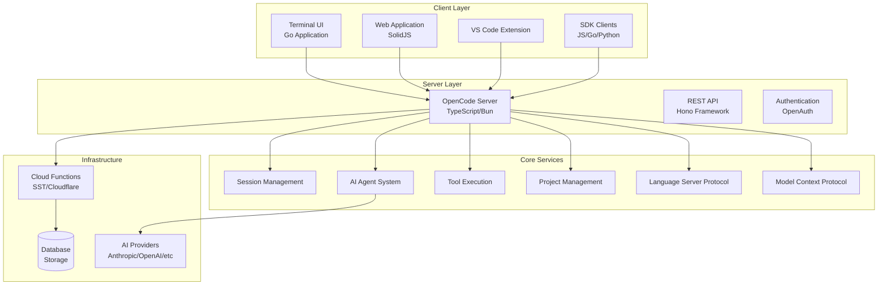

## Core Components

### 1. Terminal UI (TUI) - Go Application

The primary interface for developers, built in Go for performance and native system integration.

**Location**: `packages/tui/`

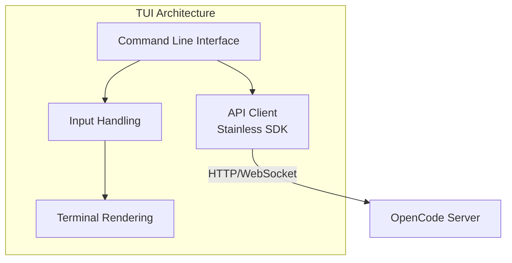

**Key Features**:
- Native terminal UI with rich interactions
- Real-time session management
- File system integration
- Git integration
- Cross-platform support

### 2. OpenCode Server - TypeScript/Bun

The core server application that orchestrates all AI coding operations.

**Location**: `packages/opencode/`

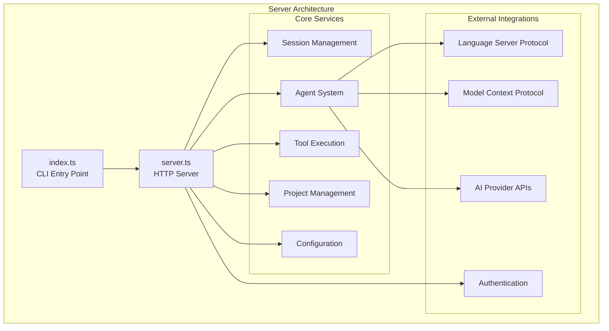

### 3. Cloud Infrastructure - SST/Cloudflare

Scalable cloud deployment using SST (Serverless Stack) on Cloudflare.

**Location**: `cloud/`, `infra/`

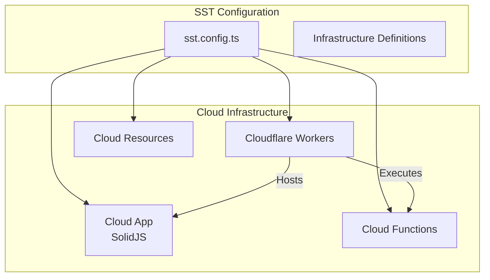

### 4. Web Application - SolidJS

Browser-based interface for OpenCode functionality.

**Location**: `cloud/app/`, `packages/web/`

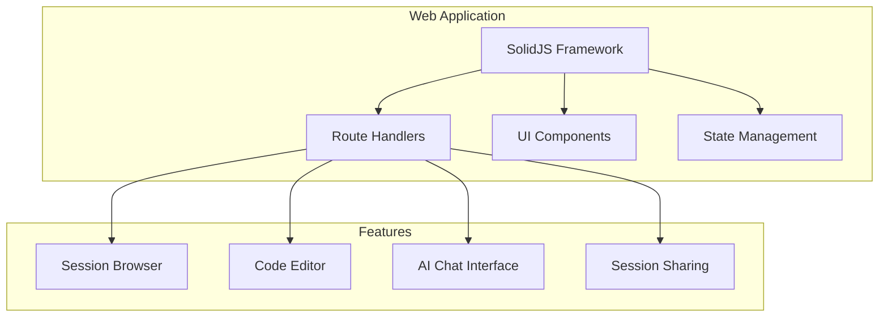

### 5. SDK Ecosystem

Multi-language SDKs for integrating OpenCode into various environments.

**Location**: `packages/sdk/`, `sdks/`

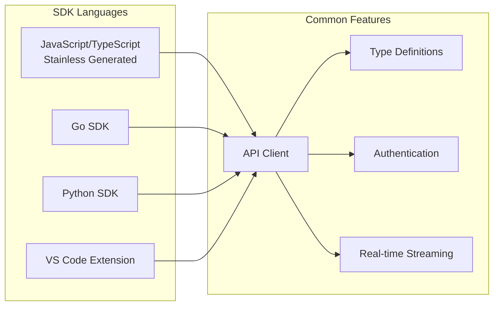

## Architecture Patterns

### 1. Session-Based Architecture

OpenCode organizes work around sessions that encapsulate project context, conversation history, and state.

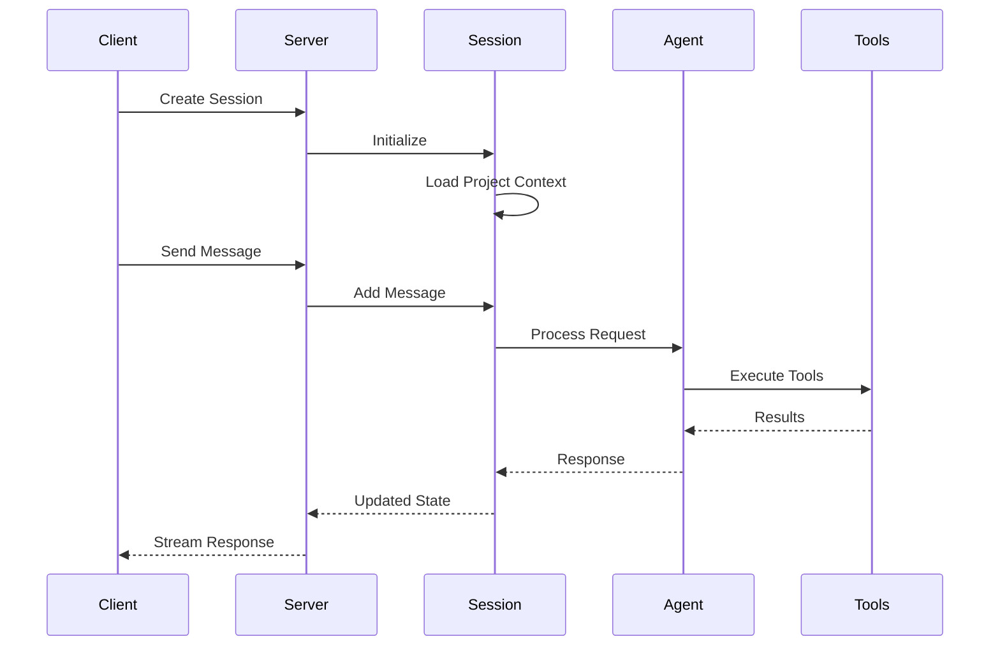

### 2. Tool-Based Execution

The system uses a tool-based architecture where AI agents can execute various tools to interact with the codebase.

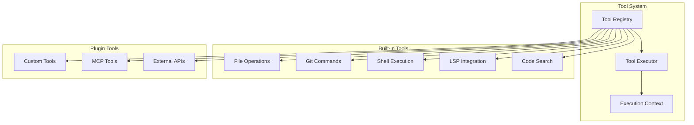

### 3. Provider-Agnostic AI Integration

OpenCode supports multiple AI providers through a unified interface.

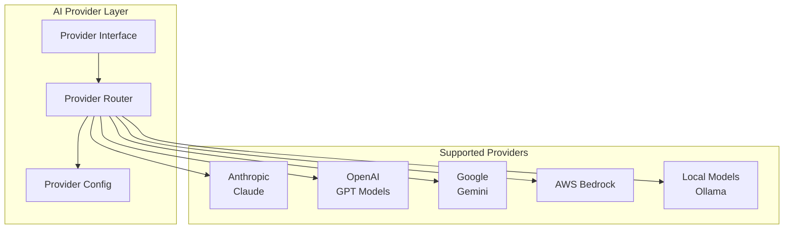

## Data Flow

### Message Processing Flow

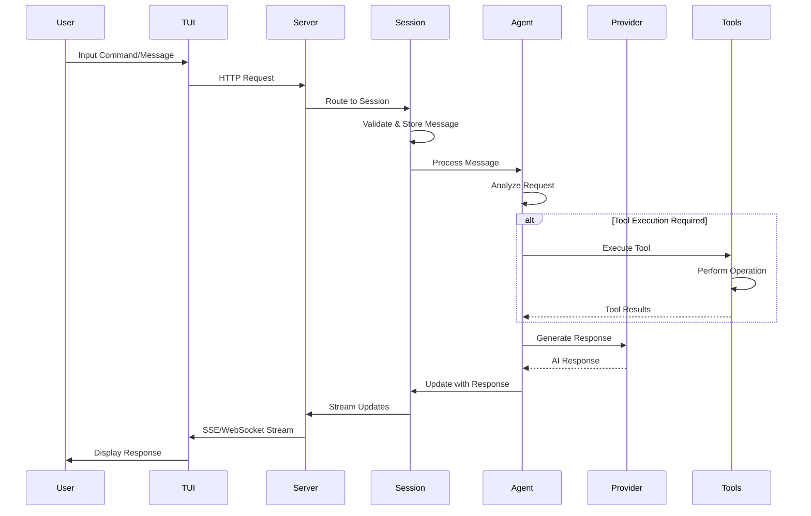

### File Operation Flow

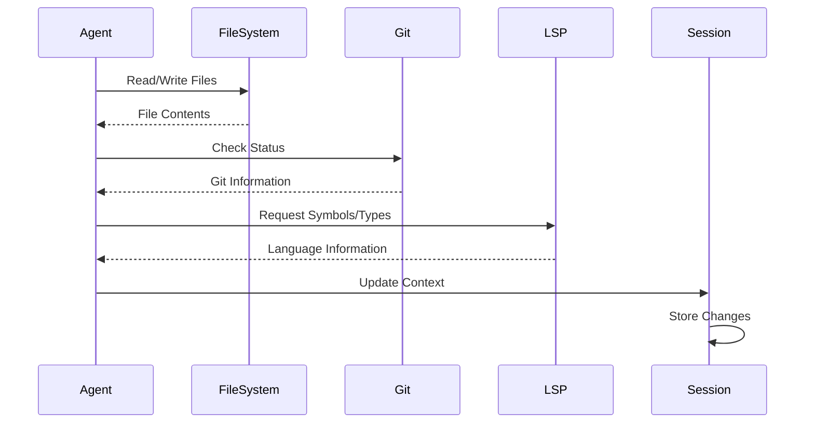

## Infrastructure

### Deployment Architecture

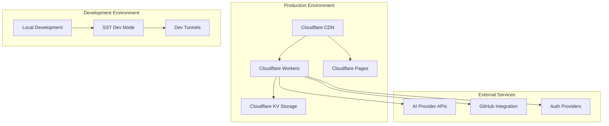

### Build and Deployment Pipeline

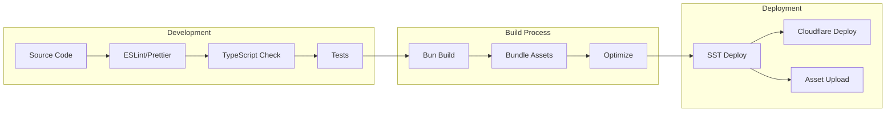

## Development Workflow

### Local Development Setup

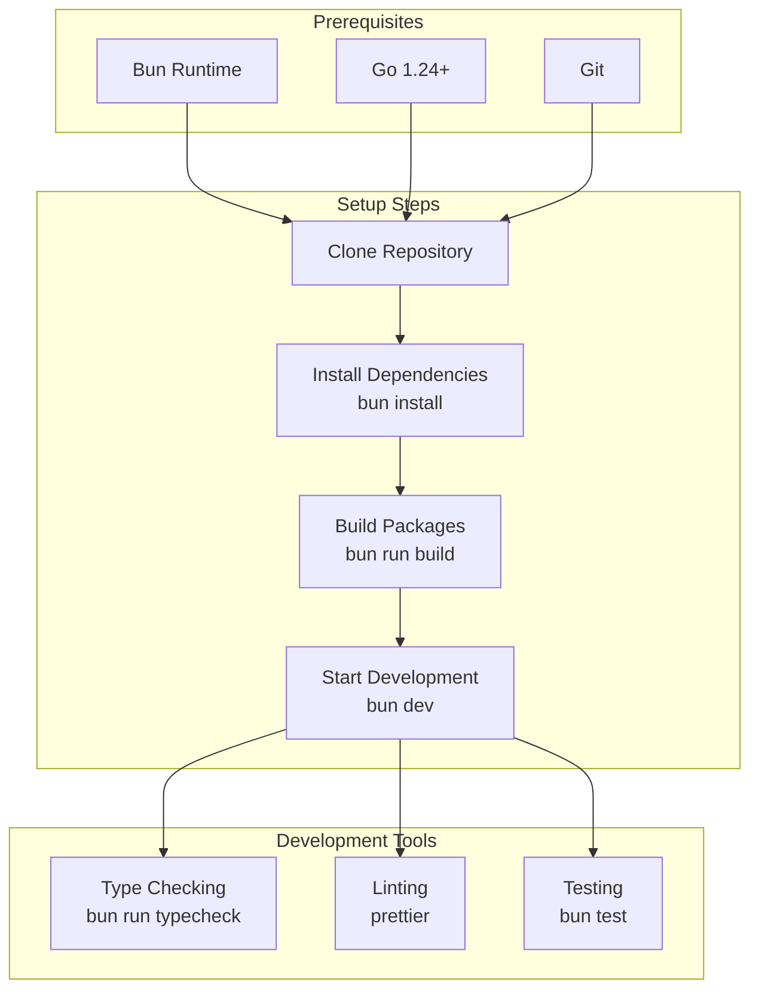

### Package Development Workflow

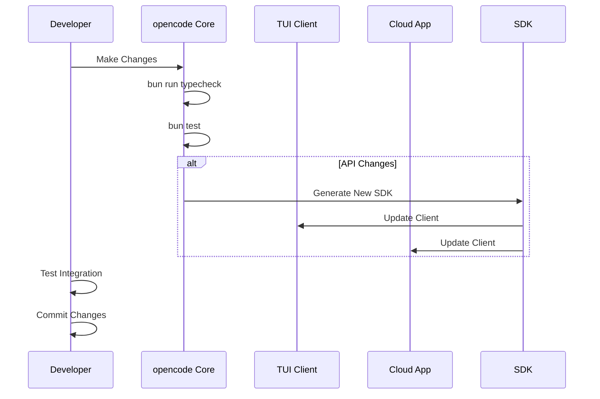

## API Structure

### REST API Endpoints

The server exposes a comprehensive REST API for all client interactions:

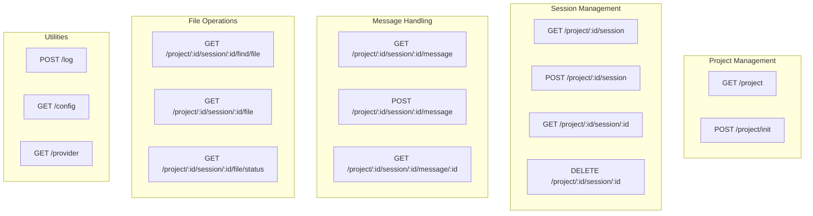

### WebSocket/SSE Streaming

Real-time communication for streaming responses and updates:

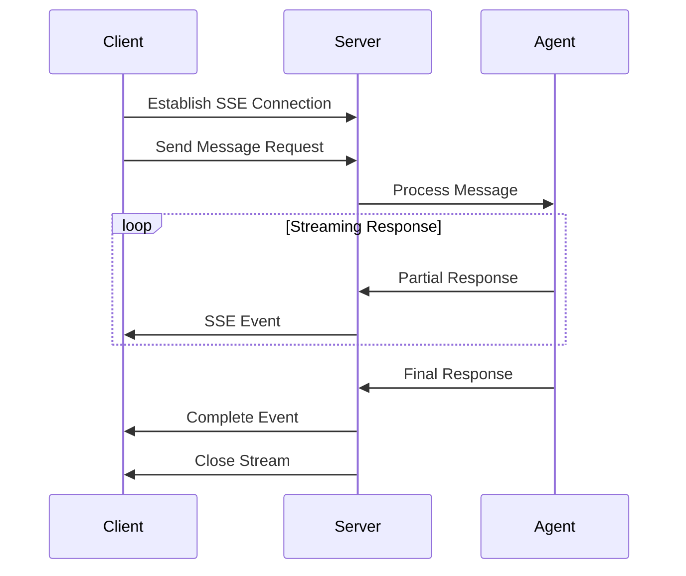

## Security & Authentication

### Authentication Flow

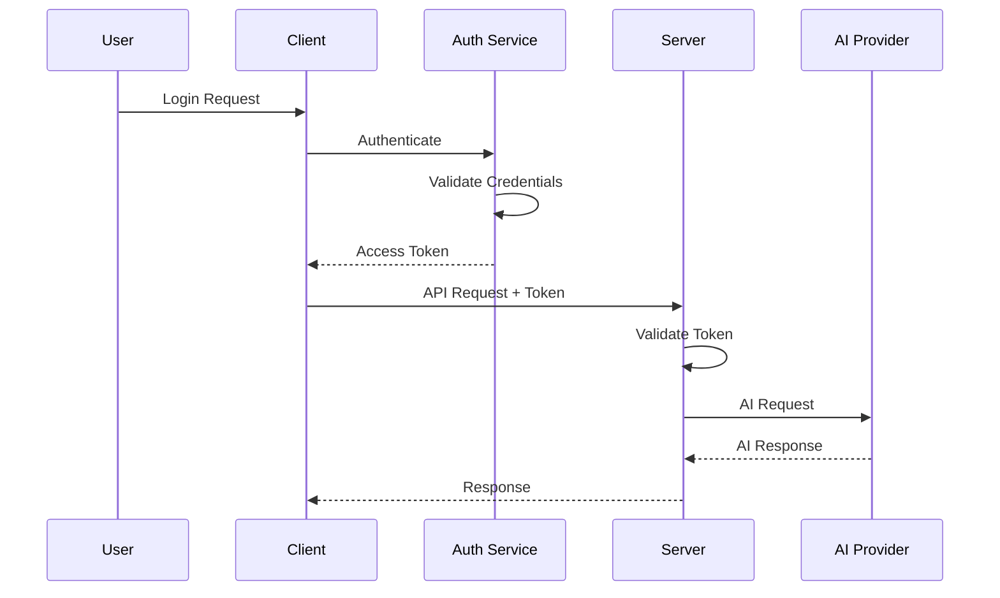

### Permission System

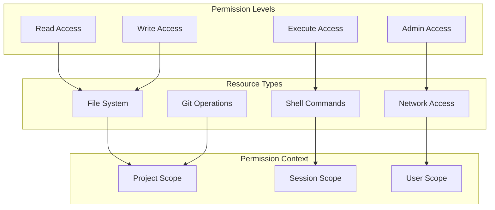

---

## Key Technologies

- **Runtime**: Bun (TypeScript/JavaScript), Go
- **Frameworks**: Hono (API), SolidJS (Web), Cobra (CLI)
- **Infrastructure**: SST, Cloudflare Workers/Pages
- **AI Integration**: Multiple providers via unified interface
- **Communication**: REST API, Server-Sent Events, WebSocket
- **Storage**: Cloudflare KV, Local file system
- **Authentication**: OpenAuth
- **Build Tools**: Bun, Go toolchain, SST

This architecture provides a scalable, maintainable, and extensible foundation for AI-powered coding assistance across multiple platforms and environments.