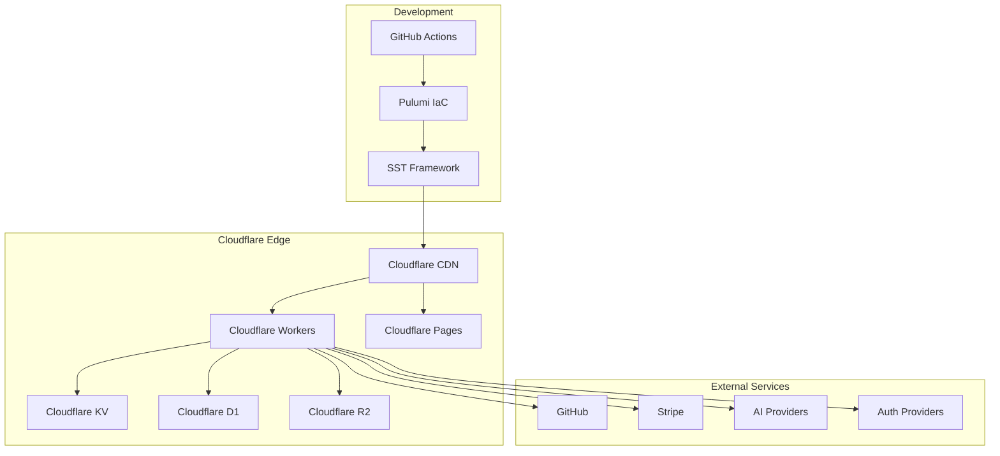
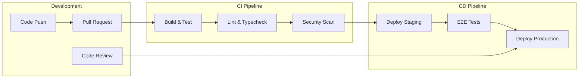
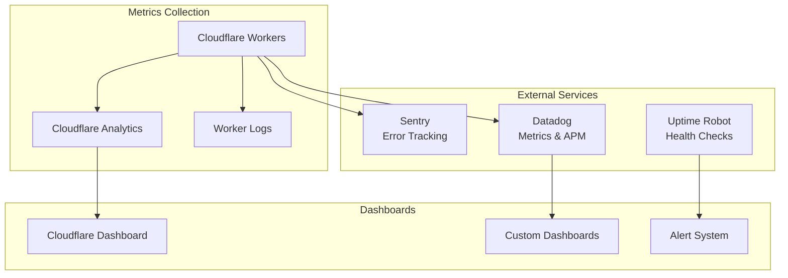
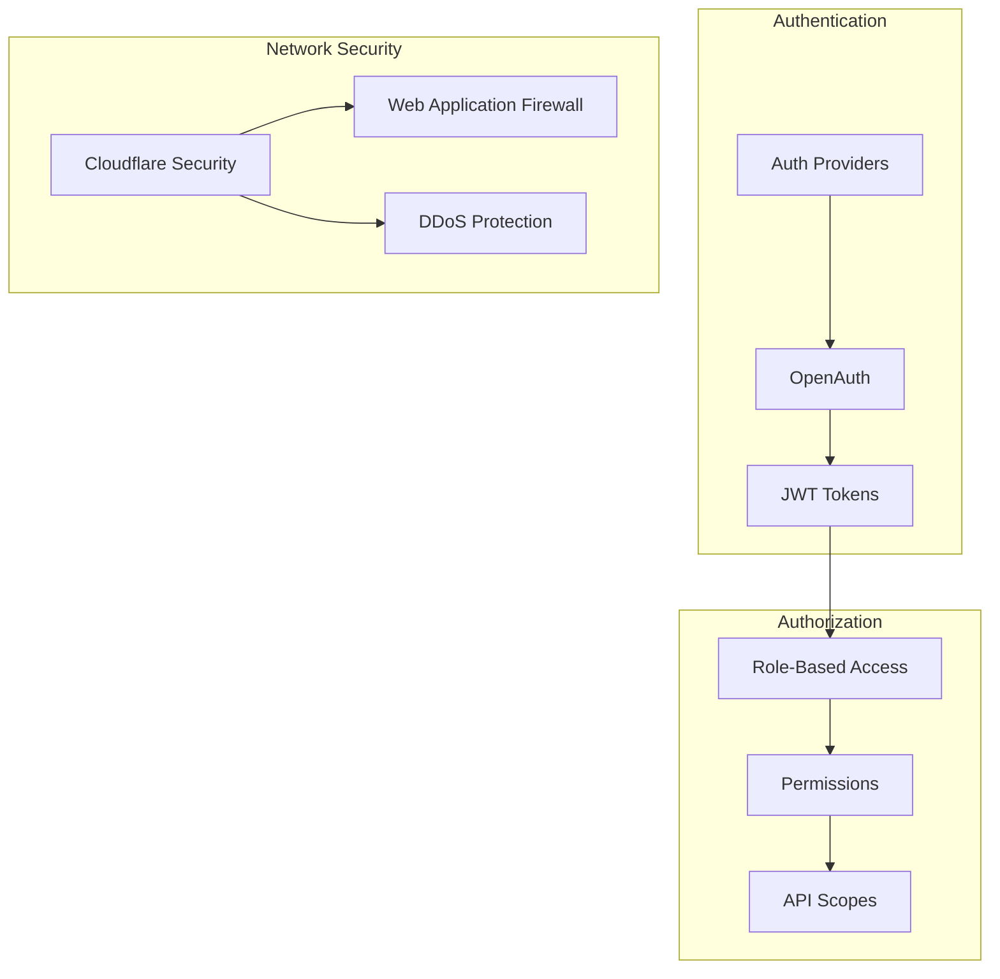
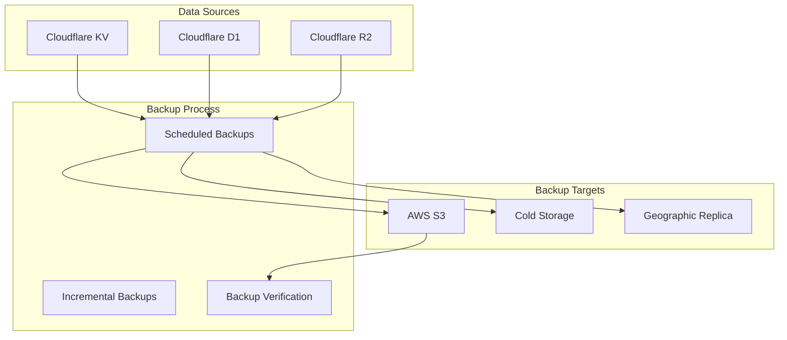
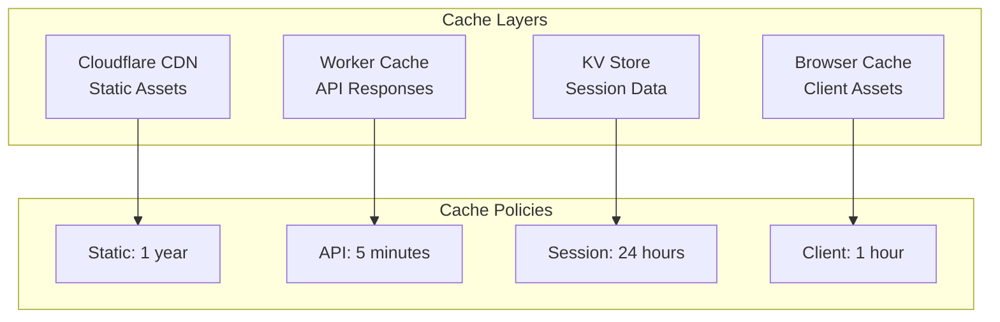

# OpenCode Deployment & Infrastructure

This document covers the deployment architecture, infrastructure setup, and operational procedures for OpenCode.

## Table of Contents

- [Infrastructure Overview](#infrastructure-overview)
- [Environment Setup](#environment-setup)
- [Deployment Pipeline](#deployment-pipeline)
- [Cloud Resources](#cloud-resources)
- [Monitoring & Observability](#monitoring--observability)
- [Security Configuration](#security-configuration)
- [Backup & Recovery](#backup--recovery)
- [Scaling & Performance](#scaling--performance)

## Infrastructure Overview

OpenCode uses a serverless-first architecture deployed on Cloudflare's edge platform through SST (Serverless Stack).



## Environment Setup

### Prerequisites

- Node.js 18+ with Bun runtime
- Go 1.24+
- AWS CLI (for SST)
- Cloudflare account and API tokens

### Environment Variables

#### Required for All Environments

```bash
# Cloudflare
CLOUDFLARE_API_TOKEN=your_cloudflare_token
CLOUDFLARE_ACCOUNT_ID=your_account_id

# AI Providers
ANTHROPIC_API_KEY=sk-ant-...
OPENAI_API_KEY=sk-...
GOOGLE_API_KEY=...

# Authentication
OPENAUTH_SECRET=random_secret_key
```

#### Production Environment

```bash
# Stripe (Production)
STRIPE_SECRET_KEY=sk_live_...
STRIPE_WEBHOOK_SECRET=whsec_...

# Database
DATABASE_URL=postgresql://...

# Monitoring
SENTRY_DSN=https://...
DATADOG_API_KEY=...
```

#### Development Environment

```bash
# Stripe (Test)
STRIPE_SECRET_KEY=sk_test_...
STRIPE_WEBHOOK_SECRET=whsec_...

# Local Development
SST_DEV=true
LOG_LEVEL=debug
```

### Local Development Setup

```bash
# Install dependencies
bun install

# Set up environment
cp .env.example .env.local
# Edit .env.local with your values

# Start development server
bun dev

# In another terminal, start SST dev mode
npx sst dev
```

## Deployment Pipeline

OpenCode uses GitHub Actions for CI/CD with automatic deployments to staging and production environments.



### GitHub Actions Workflows

#### Main Workflow (`.github/workflows/deploy.yml`)

```yaml
name: Deploy
on:
  push:
    branches: [main, dev]
  pull_request:
    branches: [main]

jobs:
  test:
    runs-on: ubuntu-latest
    steps:
      - uses: actions/checkout@v4
      - uses: oven-sh/setup-bun@v1
      - run: bun install
      - run: bun run typecheck
      - run: bun test

  deploy-staging:
    if: github.ref == 'refs/heads/dev'
    needs: test
    runs-on: ubuntu-latest
    steps:
      - uses: actions/checkout@v4
      - uses: oven-sh/setup-bun@v1
      - run: bun install
      - run: npx sst deploy --stage staging
        env:
          AWS_ACCESS_KEY_ID: ${{ secrets.AWS_ACCESS_KEY_ID }}
          AWS_SECRET_ACCESS_KEY: ${{ secrets.AWS_SECRET_ACCESS_KEY }}

  deploy-production:
    if: github.ref == 'refs/heads/main'
    needs: test
    runs-on: ubuntu-latest
    environment: production
    steps:
      - uses: actions/checkout@v4
      - uses: oven-sh/setup-bun@v1
      - run: bun install
      - run: npx sst deploy --stage production
```

## Cloud Resources

### SST Configuration

The main infrastructure is defined in `sst.config.ts`:

```typescript
export default $config({
  app(input) {
    return {
      name: "opencode",
      removal: input?.stage === "production" ? "retain" : "remove",
      protect: ["production"].includes(input?.stage),
      home: "cloudflare",
      providers: {
        stripe: {
          apiKey: process.env.STRIPE_SECRET_KEY,
        },
        planetscale: "0.4.1",
      },
    }
  },
  async run() {
    const { api } = await import("./infra/app.js")
    const { auth } = await import("./infra/cloud.js")
    
    return {
      api: api.url,
      auth: auth.url,
    }
  },
})
```

### Resource Definitions

#### API Infrastructure (`infra/app.ts`)

```typescript
export const api = new sst.cloudflare.Worker("OpenCodeAPI", {
  url: true,
  handler: "./packages/opencode/src/index.ts",
  environment: {
    ANTHROPIC_API_KEY: process.env.ANTHROPIC_API_KEY,
    OPENAI_API_KEY: process.env.OPENAI_API_KEY,
    STRIPE_SECRET_KEY: process.env.STRIPE_SECRET_KEY,
  },
  build: {
    format: "esm",
    target: "es2022",
  },
})
```

#### Web Application (`infra/cloud.ts`)

```typescript
export const web = new sst.cloudflare.StaticSite("OpenCodeWeb", {
  build: {
    command: "bun run build",
    output: "dist",
  },
  environment: {
    VITE_API_URL: api.url,
  },
})
```

#### Storage Resources

```typescript
// Key-Value Store for sessions and cache
export const kv = new sst.cloudflare.Kv("OpenCodeKV")

// Object storage for files and assets
export const r2 = new sst.cloudflare.Bucket("OpenCodeStorage")

// Database for persistent data
export const db = new sst.cloudflare.D1("OpenCodeDB")
```

## Monitoring & Observability

### Application Monitoring



### Key Metrics

#### Performance Metrics
- Response time (p50, p95, p99)
- Throughput (requests per second)
- Error rate
- Cold start latency

#### Business Metrics
- Active users
- Session duration
- API usage
- Feature adoption

#### Infrastructure Metrics
- Memory usage
- CPU utilization
- Network bandwidth
- Storage usage

### Logging Configuration

```typescript
// packages/opencode/src/util/log.ts
export namespace Log {
  export const create = (context: { service: string }) => ({
    info: (message: string, data?: any) => {
      console.log(JSON.stringify({
        level: 'info',
        service: context.service,
        message,
        data,
        timestamp: new Date().toISOString(),
        traceId: getTraceId(),
      }))
    },
    error: (message: string, error?: any) => {
      console.error(JSON.stringify({
        level: 'error',
        service: context.service,
        message,
        error: error?.message || error,
        stack: error?.stack,
        timestamp: new Date().toISOString(),
        traceId: getTraceId(),
      }))
    }
  })
}
```

### Health Checks

```typescript
// Health check endpoint
app.get('/health', (c) => {
  return c.json({
    status: 'healthy',
    timestamp: new Date().toISOString(),
    version: process.env.APP_VERSION,
    uptime: process.uptime(),
  })
})
```

## Security Configuration

### Access Control



### Security Headers

```typescript
// Security middleware
app.use('*', async (c, next) => {
  await next()
  
  c.header('X-Content-Type-Options', 'nosniff')
  c.header('X-Frame-Options', 'DENY')
  c.header('X-XSS-Protection', '1; mode=block')
  c.header('Strict-Transport-Security', 'max-age=31536000; includeSubDomains')
  c.header('Content-Security-Policy', [
    "default-src 'self'",
    "script-src 'self' 'unsafe-inline'",
    "style-src 'self' 'unsafe-inline'",
    "img-src 'self' data: https:",
    "connect-src 'self' wss: https:",
  ].join('; '))
})
```

### Environment Isolation

- **Production**: Isolated with strict access controls
- **Staging**: Semi-isolated for testing
- **Development**: Local development with mock services

## Backup & Recovery

### Data Backup Strategy



### Recovery Procedures

#### Database Recovery
```bash
# Restore from backup
npx wrangler d1 restore opencode-db --from backup-id
```

#### KV Recovery
```bash
# Export current state
npx wrangler kv:bulk download --namespace-id=ns_id

# Import from backup
npx wrangler kv:bulk put backup.json --namespace-id=ns_id
```

### Disaster Recovery Plan

1. **Detection**: Monitoring alerts trigger incident response
2. **Assessment**: Evaluate scope and impact of outage
3. **Communication**: Notify stakeholders and users
4. **Recovery**: Execute recovery procedures
5. **Verification**: Confirm service restoration
6. **Post-mortem**: Analyze incident and improve processes

## Scaling & Performance

### Auto-scaling Configuration

Cloudflare Workers automatically scale based on demand, but configuration can be optimized:

```typescript
// Worker configuration
export const api = new sst.cloudflare.Worker("OpenCodeAPI", {
  // CPU limits per request
  cpuMs: 10000,
  
  // Memory limit
  memoryMB: 128,
  
  // Concurrency settings
  compatibility: {
    flags: ["nodejs_compat"],
  },
})
```

### Performance Optimization

#### Caching Strategy



#### Database Optimization

- Connection pooling for external databases
- Query optimization and indexing
- Read replicas for scaling reads
- Caching frequently accessed data

#### Code Optimization

- Tree shaking and dead code elimination
- Lazy loading of non-critical modules
- Efficient serialization/deserialization
- Memory-efficient data structures

### Cost Optimization

- **Serverless-first**: Pay only for actual usage
- **Edge computing**: Reduced latency and bandwidth costs
- **Efficient caching**: Reduced compute and bandwidth usage
- **Resource right-sizing**: Optimal resource allocation

---

This deployment guide ensures OpenCode can be reliably deployed, monitored, and scaled across different environments while maintaining security and performance standards.