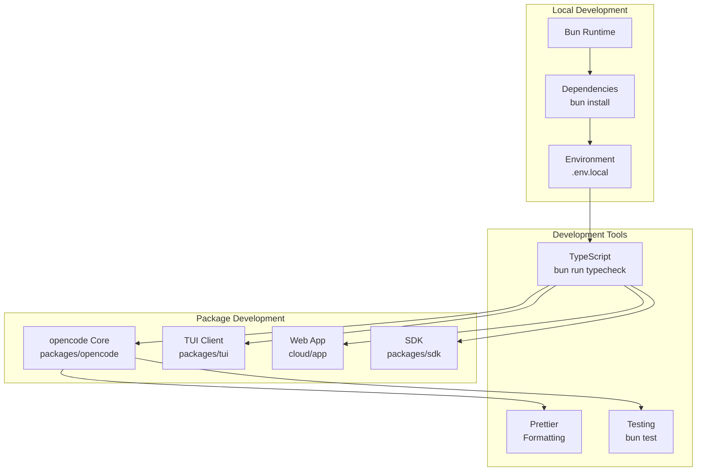
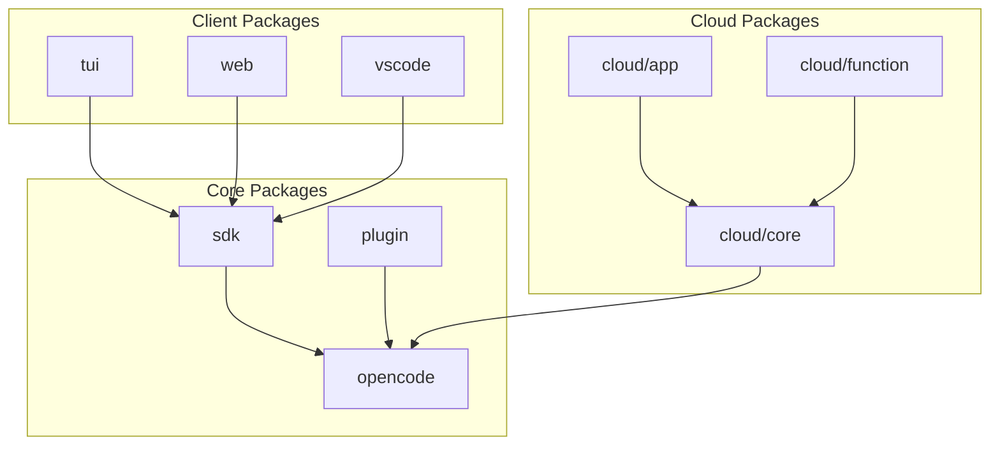
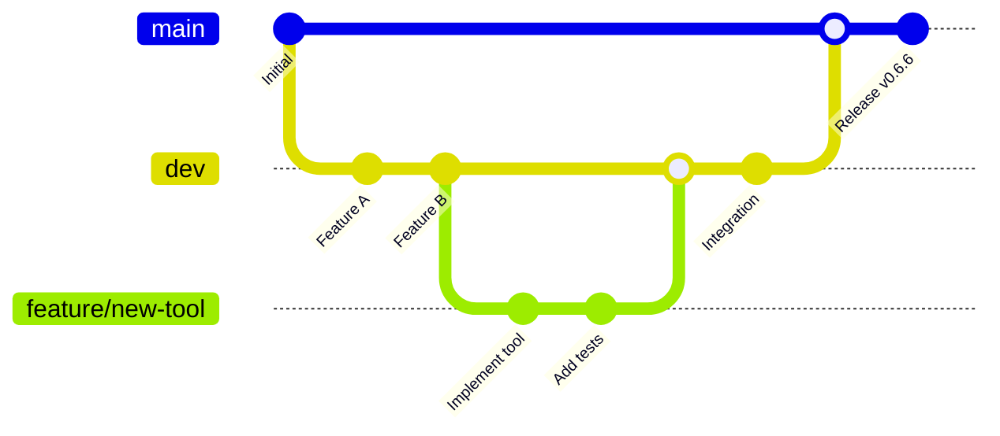
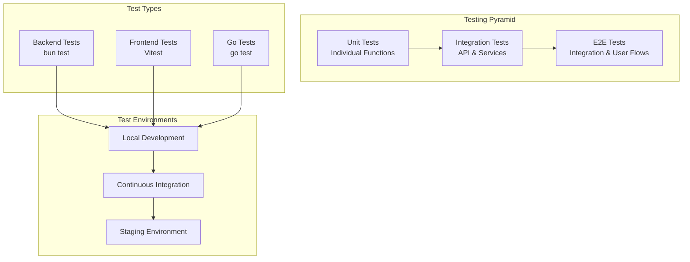
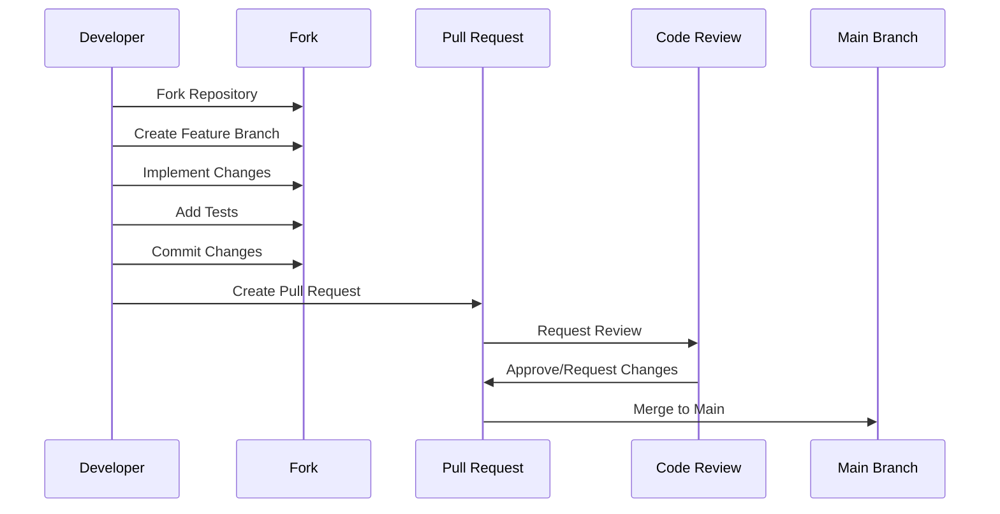
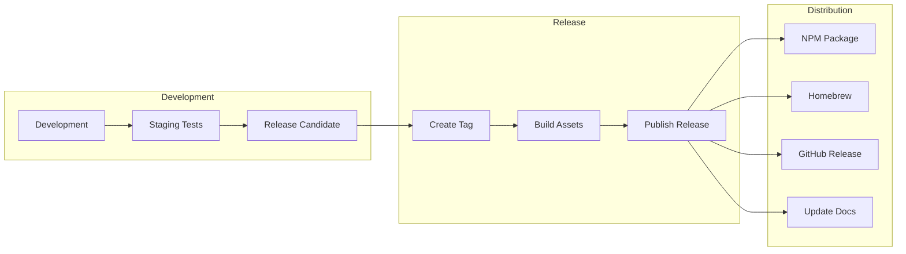

# OpenCode Development Guide

This guide covers the development workflow, contribution guidelines, and best practices for working on OpenCode.

## Table of Contents

- [Getting Started](#getting-started)
- [Project Structure](#project-structure)
- [Development Workflow](#development-workflow)
- [Testing Strategy](#testing-strategy)
- [Code Style & Standards](#code-style--standards)
- [Contribution Guidelines](#contribution-guidelines)
- [Debugging & Troubleshooting](#debugging--troubleshooting)
- [Release Process](#release-process)

## Getting Started

### Prerequisites

Ensure you have the following installed:

- **Bun** 1.2.19+ (Package manager and runtime)
- **Go** 1.24+ (For TUI client)
- **Git** (Version control)
- **VS Code** (Recommended editor)

### Installation

```bash
# Clone the repository
git clone https://github.com/sst/opencode.git
cd opencode

# Install dependencies
bun install

# Set up environment
cp .env.example .env.local
# Edit .env.local with your API keys

# Run typecheck to verify setup
bun run typecheck

# Start development server
bun dev
```

### Development Environment Setup



## Project Structure

OpenCode follows a monorepo structure organized by functional domains:

```
opencode/
├── packages/
│   ├── opencode/          # Core server and CLI
│   ├── tui/               # Terminal UI (Go)
│   ├── web/               # Web components
│   ├── sdk/               # SDK packages
│   ├── function/          # Cloud functions
│   ├── identity/          # Identity management
│   └── plugin/            # Plugin system
├── cloud/
│   ├── app/               # Cloud-hosted web app
│   ├── core/              # Shared cloud utilities
│   ├── function/          # Serverless functions
│   └── resource/          # Infrastructure resources
├── docs/                  # Documentation
├── infra/                 # Infrastructure as code
├── specs/                 # Technical specifications
└── sdks/                  # External SDK integrations
```

### Package Dependencies



## Development Workflow

### Branch Strategy

OpenCode uses a Git flow-inspired branching model:



### Workflow Steps

1. **Create Feature Branch**
   ```bash
   git checkout dev
   git pull origin dev
   git checkout -b feature/your-feature-name
   ```

2. **Development Cycle**
   ```bash
   # Make changes
   bun run typecheck  # Verify types
   bun test          # Run tests
   bun run prettier  # Format code
   ```

3. **Commit Changes**
   ```bash
   git add .
   git commit -m "feat: add new feature description"
   ```

4. **Push and Create PR**
   ```bash
   git push origin feature/your-feature-name
   # Create PR via GitHub web interface
   ```

### Package Development

#### Working on Core (`packages/opencode`)

```bash
# Navigate to core package
cd packages/opencode

# Run in development mode
bun dev

# Run specific tests
bun test src/tool/tool.test.ts

# Type check
bun run typecheck
```

For more specific guidelines, see `packages/opencode/AGENTS.md`.

#### Working on TUI (`packages/tui`)

```bash
# Navigate to TUI package
cd packages/tui

# Build and run
go build -o opencode cmd/opencode/main.go
./opencode

# Run tests
go test ./...

# Update dependencies
go mod tidy
```

#### Working on Web Components (`packages/web`)

```bash
# Navigate to web package
cd packages/web

# Start development server
bun dev

# Build for production
bun run build

# Run tests
bun test
```

## Testing Strategy

OpenCode employs a comprehensive testing strategy across all packages:



### Unit Testing

#### TypeScript/Bun Tests

```typescript
// packages/opencode/test/tool/file.test.ts
import { test, expect } from "bun:test"
import { Tool } from "../../src/tool"

test("file tool should read file contents", async () => {
  const result = await Tool.File.execute({
    action: "read",
    path: "/test/file.txt"
  })
  
  expect(result.success).toBe(true)
  expect(result.data).toContain("expected content")
})
```

#### Go Tests

```go
// packages/tui/internal/client/client_test.go
package client

import (
    "testing"
    "github.com/stretchr/testify/assert"
)

func TestClientConnection(t *testing.T) {
    client := NewClient("http://localhost:3000")
    
    err := client.Connect()
    assert.NoError(t, err)
    
    assert.True(t, client.IsConnected())
}
```

### Integration Testing

```typescript
// Integration test example
test("session workflow", async () => {
  // Create project
  const project = await api.post("/project/init", {
    path: "/test/project"
  })
  
  // Create session
  const session = await api.post(`/project/${project.id}/session`, {
    directory: "/test/project"
  })
  
  // Send message
  const response = await api.post(
    `/project/${project.id}/session/${session.id}/message`,
    { content: "Help me with this code" }
  )
  
  expect(response.status).toBe(200)
})
```

### Running Tests

```bash
# Run all tests
bun test

# Run specific package tests
bun test packages/opencode/

# Run with coverage
bun test --coverage

# Run Go tests
cd packages/tui && go test ./...

# Run E2E tests
bun test:e2e
```

## Code Style & Standards

### TypeScript Standards

OpenCode follows strict TypeScript and code style guidelines:

```typescript
// Good: Use const for immutable values
const config = {
  provider: "anthropic",
  model: "claude-3-5-sonnet-20241022"
}

// Good: Use descriptive names
const sessionManager = Session.create()

// Good: Use Zod for validation
const MessageSchema = z.object({
  content: z.string(),
  role: z.enum(["user", "assistant"])
})

// Good: Use Result patterns for error handling
const result = await Tool.execute(input)
if (!result.success) {
  return { error: result.error }
}
```

### Formatting & Linting

```bash
# Format code
bun run prettier

# Check formatting
bun run prettier --check

# Type check
bun run typecheck
```

### Commit Message Format

Follow conventional commit format:

```
<type>(<scope>): <subject>

<body>

<footer>
```

Types: `feat`, `fix`, `docs`, `style`, `refactor`, `test`, `chore`

Examples:
```
feat(tool): add file search functionality
fix(session): resolve memory leak in message handling
docs(api): update authentication documentation
```

## Contribution Guidelines

### Before Contributing

1. **Read the Documentation**: Understand the architecture and patterns
2. **Check Existing Issues**: Look for related work or discussions
3. **Small Changes First**: Start with bug fixes or small improvements
4. **Design Discussion**: For major features, open an issue for discussion

### Contribution Process



### Code Review Checklist

- [ ] Code follows style guidelines
- [ ] Tests are included and passing
- [ ] Documentation is updated
- [ ] Breaking changes are noted
- [ ] Performance impact is considered
- [ ] Security implications are reviewed

### What We Accept

✅ **Do Contribute**:
- Bug fixes
- Performance improvements
- LLM integration improvements
- New provider support
- Environment-specific fixes
- Documentation improvements
- Test coverage improvements

❌ **We Don't Accept**:
- Fundamental architecture changes without discussion
- Breaking changes without migration path
- Code that doesn't follow our standards
- Features without tests
- Changes that hurt performance significantly

## Debugging & Troubleshooting

### Development Debugging

#### TypeScript Debugging

```typescript
// Use Log.create for structured logging
const log = Log.create({ service: "debug" })

log.info("Processing message", { messageId, sessionId })
log.error("Tool execution failed", error)
```

#### Go Debugging

```go
// Use standard log package with context
log.Printf("Client connecting to %s", serverURL)

// For detailed debugging
if debug {
    log.Printf("Request: %+v", request)
}
```

### Common Issues

#### Bun Installation Issues

```bash
# Clear cache and reinstall
rm -rf node_modules bun.lockb
bun install
```

#### TypeScript Errors

```bash
# Clear TypeScript cache
rm -rf .tsbuildinfo
bun run typecheck
```

#### Go Build Issues

```bash
# Clean and rebuild
cd packages/tui
go clean -cache
go mod download
go build ./...
```

### Performance Profiling

#### Bun Profiling

```bash
# Profile memory usage
bun --inspect src/index.ts

# Profile performance
bun --inspect-brk src/index.ts
```

#### Go Profiling

```go
import _ "net/http/pprof"

go func() {
    log.Println(http.ListenAndServe("localhost:6060", nil))
}()
```

## Release Process

### Versioning Strategy

OpenCode follows semantic versioning (SemVer):

- **Major** (x.0.0): Breaking changes
- **Minor** (0.x.0): New features, backward compatible
- **Patch** (0.0.x): Bug fixes, backward compatible

### Release Workflow



### Creating a Release

1. **Prepare Release**
   ```bash
   # Update version in package.json
   bun version patch  # or minor/major
   
   # Update CHANGELOG.md
   # Update documentation if needed
   ```

2. **Test Release**
   ```bash
   # Run full test suite
   bun test
   bun run typecheck
   
   # Build all packages
   bun run build
   ```

3. **Create Release**
   ```bash
   # Create and push tag
   git tag v0.6.6
   git push origin v0.6.6
   
   # GitHub Actions will handle the rest
   ```

### Post-Release

- Monitor deployment and metrics
- Update documentation website
- Announce on social media and Discord
- Monitor for bug reports

---

This development guide ensures consistent, high-quality contributions to OpenCode while maintaining the project's architectural integrity and performance standards.