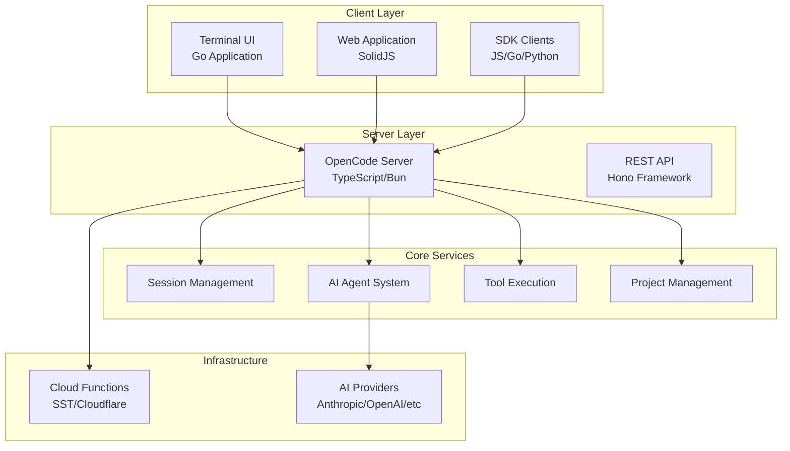
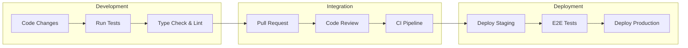

# OpenCode Documentation

Comprehensive technical documentation for the OpenCode AI coding agent system.

## Overview

OpenCode is a client-server AI coding agent built with TypeScript/Bun and Go, featuring a terminal UI, web interface, and multi-language SDK support. It provides intelligent code assistance through various AI providers in a scalable, serverless architecture.

## Documentation Structure

### 📐 [Technical Architecture](./ARCHITECTURE.md)
Complete system architecture documentation with Mermaid diagrams covering:
- System overview and component relationships
- Client-server architecture patterns
- Core services and integrations
- Data flow and message processing
- Infrastructure and deployment architecture
- Security and authentication flows

### 🔌 [API Documentation](./API.md)
Comprehensive REST API and WebSocket documentation including:
- Authentication and authorization
- Project and session management
- Message handling and streaming
- File operations and git integration
- Real-time communication protocols
- Error handling and rate limiting

### 🚀 [Deployment Guide](./DEPLOYMENT.md)
Infrastructure and deployment documentation covering:
- Cloudflare/SST serverless architecture
- Environment setup and configuration
- CI/CD pipeline with GitHub Actions
- Monitoring, logging, and observability
- Security configuration and best practices
- Backup, recovery, and scaling strategies

### 👨‍💻 [Development Guide](./DEVELOPMENT.md)
Developer workflow and contribution guidelines including:
- Local development setup
- Project structure and package organization
- Testing strategy and best practices
- Code style standards and linting
- Contribution process and code review
- Debugging and troubleshooting guides

## Quick Navigation

### For Developers
- **Getting Started**: [Development Guide - Getting Started](./DEVELOPMENT.md#getting-started)
- **Project Structure**: [Development Guide - Project Structure](./DEVELOPMENT.md#project-structure)
- **Testing**: [Development Guide - Testing Strategy](./DEVELOPMENT.md#testing-strategy)
- **Code Style**: [Development Guide - Code Style & Standards](./DEVELOPMENT.md#code-style--standards)

### For DevOps/Infrastructure
- **Infrastructure Overview**: [Deployment Guide - Infrastructure Overview](./DEPLOYMENT.md#infrastructure-overview)
- **Environment Setup**: [Deployment Guide - Environment Setup](./DEPLOYMENT.md#environment-setup)
- **CI/CD Pipeline**: [Deployment Guide - Deployment Pipeline](./DEPLOYMENT.md#deployment-pipeline)
- **Monitoring**: [Deployment Guide - Monitoring & Observability](./DEPLOYMENT.md#monitoring--observability)

### For API Integration
- **Authentication**: [API Documentation - Authentication](./API.md#authentication)
- **REST Endpoints**: [API Documentation - REST API Endpoints](./API.md#rest-api-endpoints)
- **WebSocket/SSE**: [API Documentation - Real-time Communication](./API.md#real-time-communication)
- **Error Handling**: [API Documentation - Error Handling](./API.md#error-handling)

### For Architecture Understanding
- **System Overview**: [Architecture - System Overview](./ARCHITECTURE.md#system-overview)
- **Core Components**: [Architecture - Core Components](./ARCHITECTURE.md#core-components)
- **Data Flow**: [Architecture - Data Flow](./ARCHITECTURE.md#data-flow)
- **Security**: [Architecture - Security & Authentication](./ARCHITECTURE.md#security--authentication)

## Architecture at a Glance



## Key Technologies

| Layer | Technologies |
|-------|-------------|
| **Frontend** | SolidJS, TypeScript, CSS |
| **Backend** | Bun, TypeScript, Hono |
| **TUI** | Go, Cobra CLI |
| **Infrastructure** | SST, Cloudflare Workers/Pages |
| **AI Integration** | Anthropic, OpenAI, Google, AWS Bedrock |
| **Communication** | REST API, Server-Sent Events, WebSocket |
| **Storage** | Cloudflare KV, D1, R2 |
| **Authentication** | OpenAuth |
| **Build/Deploy** | Bun, Go toolchain, GitHub Actions |

## Development Workflow



## Contributing

We welcome contributions! Please see our [Development Guide](./DEVELOPMENT.md#contribution-guidelines) for detailed information on:

- Setting up your development environment
- Understanding our code style and standards
- Running tests and ensuring quality
- Submitting pull requests
- Code review process

### Quick Start for Contributors

```bash
# Clone and setup
git clone https://github.com/sst/opencode.git
cd opencode
bun install

# Run development server
bun dev

# Run tests
bun test

# Check types and formatting
bun run typecheck
```

## Support and Community

- **GitHub Issues**: [Report bugs and request features](https://github.com/sst/opencode/issues)
- **Discord**: [Join our community](https://discord.gg/opencode)
- **Documentation**: [Main documentation](https://opencode.ai/docs)
- **Examples**: Check the `examples/` directory for usage examples

## License

OpenCode is open source software licensed under the [MIT License](../LICENSE).

---

For more detailed information on any aspect of OpenCode, please refer to the specific documentation files linked above.